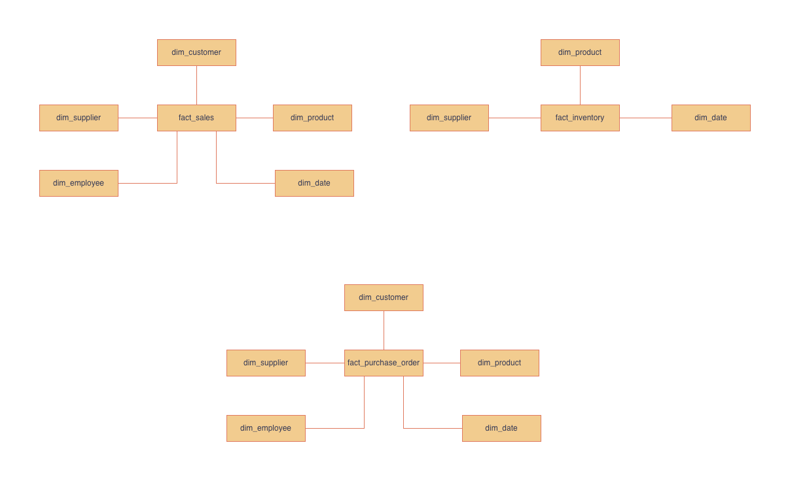
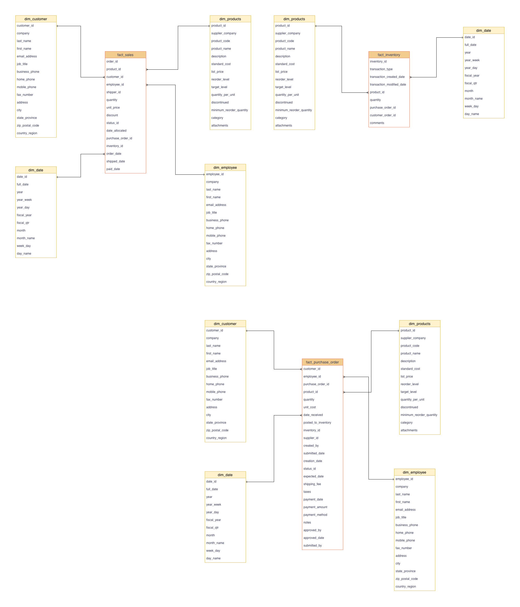
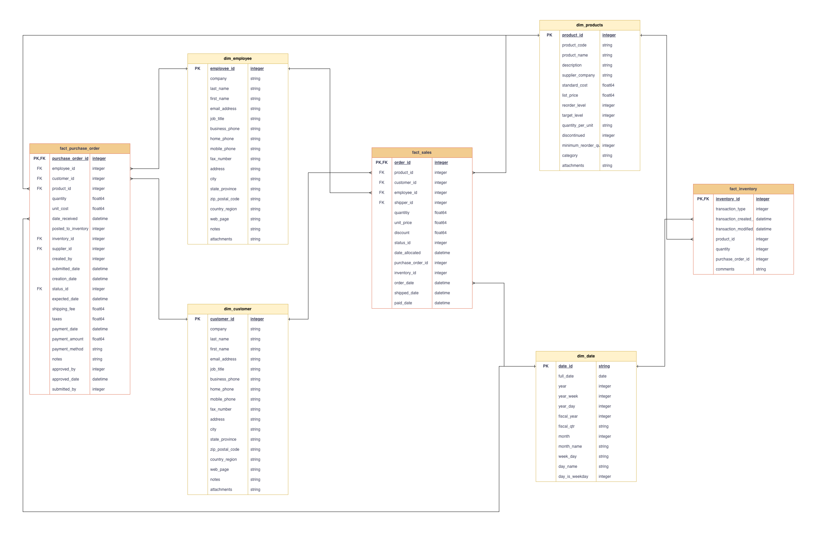

# dbt Data Warehouse – Northwind Project

This repository showcases a modern data warehouse implementation using **dbt (Data Build Tool)** with **Google BigQuery** as the underlying platform.  
It transforms the classic **Northwind** dataset into a fully modeled, analytics-ready warehouse — designed to demonstrate clean data architecture, layered transformations, and maintainable SQL modeling patterns.

---

## Overview

This project focuses on **data modeling and transformation architecture**, not pipeline orchestration or CI/CD automation.  
It is designed to illustrate how raw data can evolve through clearly defined layers within a dbt project, each serving a distinct analytical purpose.

The implementation uses **BigQuery tables as a simulated data lake** for demonstration, allowing the project to run end-to-end without relying on external data ingestion systems.

---

## Architecture and Layers

The project follows a **three-tier architecture** that mirrors how data typically flows through a modern warehouse ecosystem:

### 1. Staging Layer  
Implemented as a set of BigQuery tables serving as raw data copies.  
This layer focuses on:  
- Establishing a consistent schema and naming convention.  
- Cleaning and type-casting raw data.  
- Preserving data lineage from the original Northwind dataset.  

The purpose is to simulate ingestion from a real operational system while maintaining simplicity for demonstration.

### 2. Warehouse Layer  
Implements the **core data warehouse** following **Kimball-style dimensional modeling**.  
This layer contains:  
- **Dimension models** – customers, employees, products, suppliers, etc.  
- **Fact models** – orders, order details, and sales metrics.  

All business logic for analytical consistency is consolidated here, forming the single source of truth for downstream analytics.

### 3. Analytics (OBT) Layer  
Designed for **Business Intelligence consumption**, this layer exposes **one-big-table (OBT)** style datasets.  
These models flatten key relationships to deliver analysis-ready tables that can be directly consumed by visualization tools such as **Tableau**, **Looker**, or **Power BI**.  

It serves as the final transformation step, optimized for usability rather than data modeling purity.

---

## Data Modeling Diagrams

The following diagrams illustrate the evolution of the data model across layers:

**Conceptual Diagram**  

**Logical Model**  

**Physical Model**  

---

## Environment Setup for dbt + BigQuery (macOS)

To replicate this project or connect dbt Core with BigQuery on macOS, refer to my detailed Medium article:

👉 [How to Connect dbt Core with BigQuery on macOS – A Practical Setup Guide](https://medium.com/@ishan_pathirana/how-to-connect-dbt-core-with-bigquery-on-macos-a-practical-setup-guide-679f9e6cc38d)

This guide walks through installing the Google Cloud SDK, authenticating your account, and configuring dbt profiles for seamless BigQuery integration.

---

## Scope and Clarifications

- This project uses **static BigQuery tables as the data lake layer**, not an actual ingestion pipeline.  
- It focuses purely on **transformation, modeling, and analytics readiness** within dbt.  
- There is **no orchestration, SCD handling, or CI/CD automation** implemented.  
- The design principles, however, are directly transferable to production-grade data warehouse environments.

---

## Author

**Ishan Pathirana**  
Associate Technical Lead – Data Engineering  
AWS Certified Data Engineer 

Focused on building cloud-native, scalable, and analytics-driven data platforms that bridge engineering and business outcomes.
